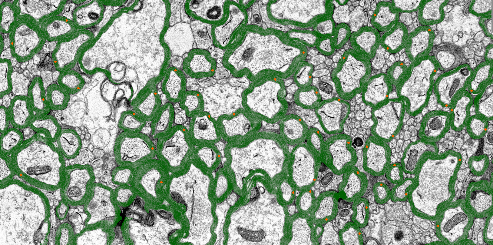

# comparative measurements
The scripts in this section are used to compare manual measurements (myelin thickness, axon diameter, g-ratio) taken by an expert with the output of our automatic method. We exclude from this comparison all axons that were not manually measured, so we are comparing paired measurements. 

To use these scripts, please use an `AxonDeepSeg` virtual environment.



## Run the pipeline
First, make sure you have activated a virtual environment with `AxonDeepSeg` installed.

Second, you need to preprocess the raw, manual measurements exported from ImageJ

```bash
python preprocess_manual_measurements.py 
```

Then, you will need to match the axons between manual and automatic measurements. This requires 2 folders. The first directory contains the output CSV files from the previous command. The second directory contains all images + all ADS segmentations + all ADS morphometric files, i.e.

```
segmented_dir/
├─ img1.png
├─ img1_seg-axon.png
├─ img1_seg-myelin.png
├─ img1_seg-uaxon.png
├─ img1_axon_morphometrics.xlsx     <-- important: contains auto measurements (for ~all M axons in the image with M >> N)
├─ img1_instance_map.png            <-- important: 16-bit instance seg
├─ ...
```

```bash
python match_axons.py csv_dir segmented_dir
```